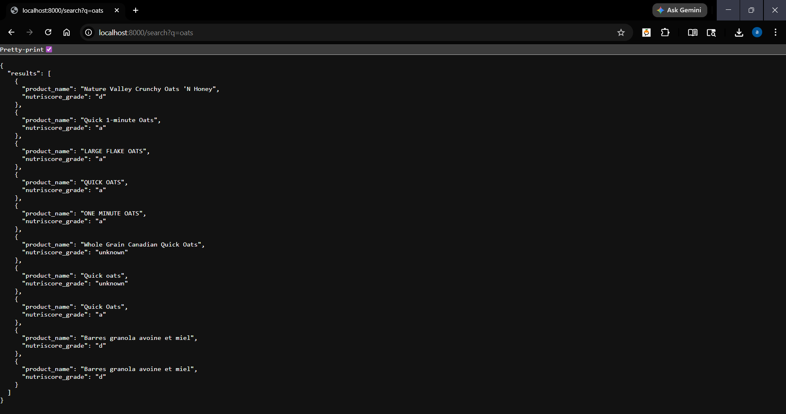
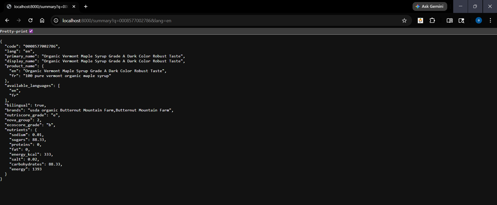
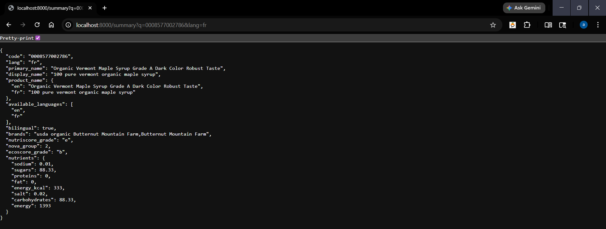
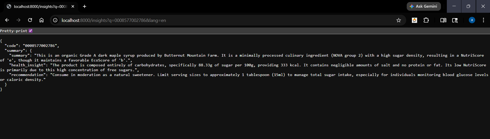
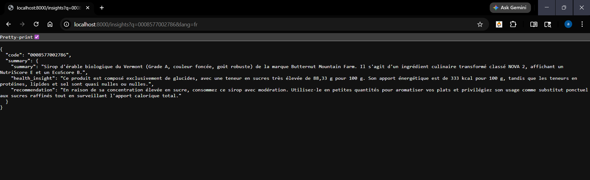

# 🧠 AI-Powered Product Insights API (Open Food Facts Canada)

An AI-powered backend service that transforms raw Open Food Facts data into clear, actionable insights using **FastAPI**, **DuckDB**, and **LLMs (Gemini)**.

It enables users to understand complex nutritional data through:

- 📝 Summaries
- ❤️ Health insights
- 🥗 Actionable recommendations

---

## 🚀 Features

- 🔍 Product Search API
- 📊 Structured Product Summary
- 🤖 AI-Powered Insights (LLM-based)
- 🌍 Bilingual Support (EN/FR)
- ⚡ High-performance OLAP queries with DuckDB
- 🧠 LLM Response Caching

---

## 🏗️ Architecture

````
Client
  │
  ▼
FastAPI
  │
  ├── Check Cache ──► If HIT → Return
  │
  ├── Query DuckDB → Get product data
  │
  └── Call Gemini LLM → Generate insights
           │
           ▼
        Store in Cache
           │
           ▼
         Return
---

## 📦 Installation

```bash
git clone https://github.com/your-username/off-ai-insights.git
cd off-ai-insights
pip install -r requirements.txt
````

Create `.env`:

```
GEMINI_API_KEY=your_api_key_here
```

---

## ▶️ Run

```bash
uvicorn main:app --reload
or
uvicorn server:app --reload --reload-dir .
```

---

## 📡 API

### `/search?q=`

Search for products.

```json
{
	"results": [
		{
			"product_name": "Nature Valley Crunchy Oats 'N Honey",
			"nutriscore_grade": "d"
		},
		{
			"product_name": "Quick 1-minute Oats",
			"nutriscore_grade": "a"
		},
		{
			"product_name": "LARGE FLAKE OATS",
			"nutriscore_grade": "a"
		},
		{
			"product_name": "QUICK OATS",
			"nutriscore_grade": "a"
		},
		{
			"product_name": "ONE MINUTE OATS",
			"nutriscore_grade": "a"
		},
		{
			"product_name": "Whole Grain Canadian Quick Oats",
			"nutriscore_grade": "unknown"
		},
		{
			"product_name": "Quick oats",
			"nutriscore_grade": "unknown"
		},
		{
			"product_name": "Quick Oats",
			"nutriscore_grade": "a"
		},
		{
			"product_name": "Barres granola avoine et miel",
			"nutriscore_grade": "d"
		},
		{
			"product_name": "Barres granola avoine et miel",
			"nutriscore_grade": "d"
		}
	]
}
```

#### Response Preview

**English**


---

### `/summary?q=&lang=en|fr`

Returns structured product data.

#### Example Response

```json
{
	"code": "0008577002786",
	"lang": "en",
	"primary_name": "Organic Vermont Maple Syrup Grade A Dark Color Robust Taste",
	"display_name": "Organic Vermont Maple Syrup Grade A Dark Color Robust Taste",
	"product_name": {
		"en": "Organic Vermont Maple Syrup Grade A Dark Color Robust Taste",
		"fr": "100 pure vermont organic maple syrup"
	},
	"available_languages": ["en", "fr"],
	"bilingual": true,
	"brands": "usda organic Butternut Mountain Farm,Butternut Mountain Farm",
	"nutriscore_grade": "e",
	"nova_group": 2,
	"ecoscore_grade": "b",
	"nutrients": {
		"sodium": 0.01,
		"sugars": 88.33,
		"proteins": 0,
		"fat": 0,
		"energy_kcal": 333,
		"salt": 0.02,
		"carbohydrates": 88.33,
		"energy": 1393
	}
}
```

#### Response Preview

**English**


**French**


---

### `/insights?q=&lang=en|fr`

Returns AI-generated insights.

#### Example Response

```json
{
	"code": "0008577002786",
	"summary": {
		"summary": "This is an organic Grade A dark maple syrup produced by Butternut Mountain Farm. It is a minimally processed culinary ingredient (NOVA group 2) with a high sugar density, resulting in a NutriScore of 'e', though it maintains a favorable EcoScore of 'b'.",
		"health_insight": "The product is composed entirely of carbohydrates, specifically 88.33g of sugar per 100g, providing 333 kcal. It contains negligible amounts of salt and no protein or fat. Its low NutriScore is primarily due to this high concentration of free sugars.",
		"recommendation": "Consume in moderation as a natural sweetener. Limit serving sizes to approximately 1 tablespoon (15ml) to manage total sugar intake, especially for individuals monitoring blood glucose levels or caloric density."
	}
}
```

#### Response Preview

**English**


**French**


---

## 🧠 How It Works

1. Query product data from DuckDB
2. Clean and structure nutrients
3. Send data to Gemini LLM
4. Generate JSON insights
5. Cache results
6. Return cache results if user queries the same product

---

## 🌍 Bilingual Support

Supports English and French outputs for Canadian users.

---

## 🔮 Future Work

- Better recommendations
- Vector search using cosine similarity
- Product Page Integration

---

```

```
